# 2420 Assignment 2
#### Step 1 - Setting up DigitalOcean droplets, VPC, Loadbalancer, and Firewall

Start by creating infrastructure on DigitalOcean. Follow the video to do this: https://vimeo.com/775412708/4a219b37e7

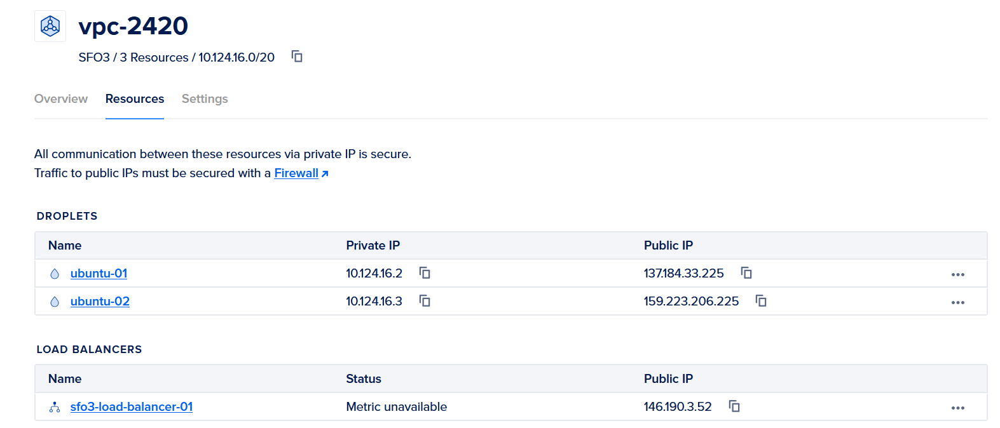

#### Step 2 - Set up users

Create a regular user for each droplet following the video. Make sure they have passwords, proper permissions, and disable root login.

#### Step 3 - Install Caddy

```wget https://github.com/caddyserver/caddy/releases/download/v2.6.2/caddy_2.6.2_linux_amd64.tar.gz```
Install caddy onto your system

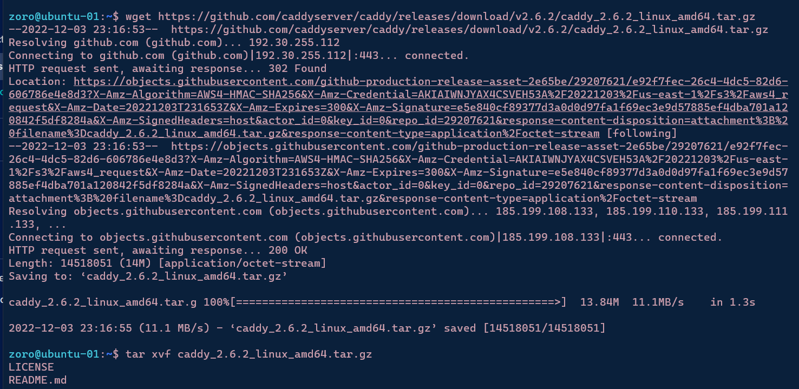

```tar xvf caddy_2.6.2_linux_amd64.tar.gz```
Use this command to extract it

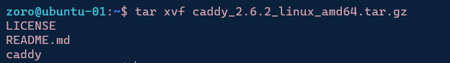

Give root access and move file to /usr/bin/

```sudo chown root: caddy```
```sudo cp caddy /usr/bin/```

#### Step 4 - Preparing Web App
Use wsl to create two directories: html and src

Create an index.html file in the html directory using vim.

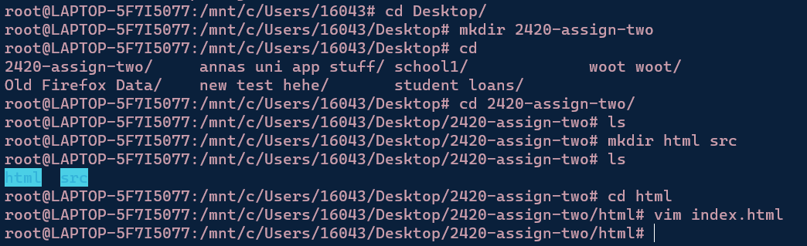

Within the src directory, create:


```npm init```
```npm i fastify```
```npm index.js```

In index.js, add the following script:

```// Require the framework and instantiate it
const fastify = require('fastify')({ logger: true })

// Declare a route
fastify.get('/api', async (request, reply) => {
  return { hello: 'Server x' }
})

// Run the server!
const start = async () => {
  try {
    await fastify.listen({ port: 5050 })
  } catch (err) {
    fastify.log.error(err)
    process.exit(1)
  }
}
start()
```
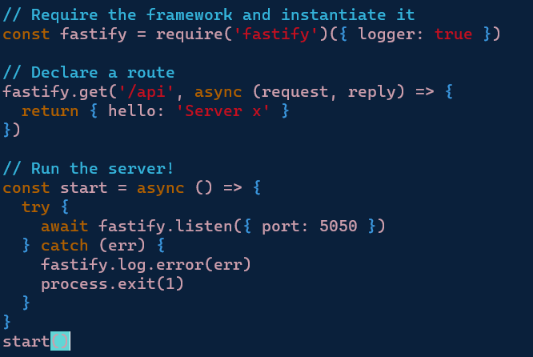

Finally, install Node with Volta in wsl.

```
# install Volta
curl https://get.volta.sh | bash
source ~/.bashrc

# install Node
volta install node
```


#### Step 5: Write CaddyFile

Create Caddyfile and caddy.service with WSL:

```
vim Caddyfile

http://146.190.3.52 {
    root * /var/www
    reverse_proxy /api             localhost:5050
    file_server    
}
```

```
vim caddy.service

[Unit]
Description=Server HTML in /var/www using caddy
After=network.target

[Service]
Type=notify
ExecStart=/usr/bin/caddy run --config /etc/caddy/Caddyfile
ExecReload=/usr/bin/caddy reload --config /etc/caddy/Caddyfile
TimeoutStopSec=5
KillMode=mixed

[Install]
WantedBy=multi-user.target
```
#### Step 6: Install Node with Volta

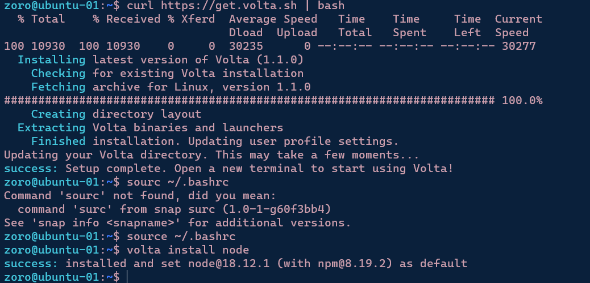

#### Step 7: Create hello_web.service file

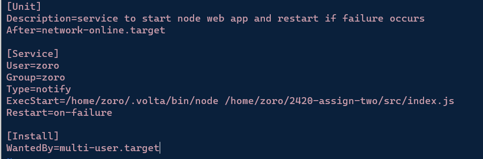

#### Step 8: Use WSL SFTP to Move Files to Droplets

Connect WSL to droplets using sftp:

```
sftp -i ~/.ssh/DO_key zoro@137.184.33.225
put caddy.service
put Caddyfile
put hello_web.service

# from html subdirectory
put index.html

# from src subdirectory
put index.js
put package.json
put package-lock.json
```
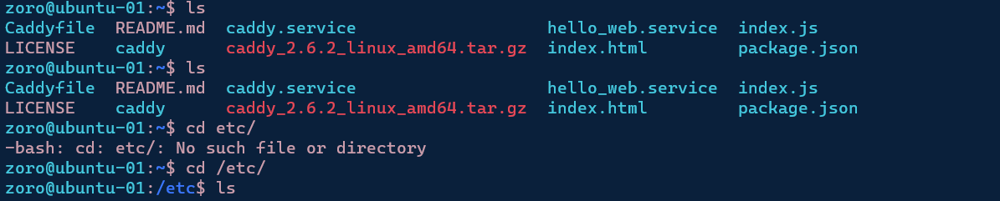

Move the files into the intended directories.

```
sudo cp caddy.service /etc/systemd/system/caddy.service
sudo cp hello_web.service /etc/systemd/system/hello_web.service
sudo cp Caddyfile /etc/caddy/Caddyfile
sudo cp index.html /var/www/index.html
```

Change the index.html file for each droplet to differentiate between the two. 

```
systemctl enable caddy.service
systemctl start caddy.service
systemctl status caddy.service
```
Install fastify in the Droplet directories that install contain index.js.


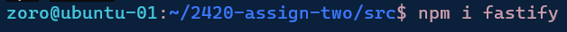

```
systemctl enable hello_web.service
system start hello_web.service
system status hello_web.service
```

Step 9: Make sure it works!

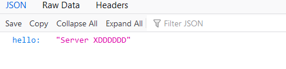
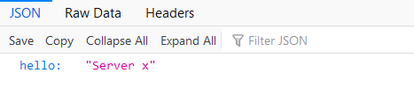


